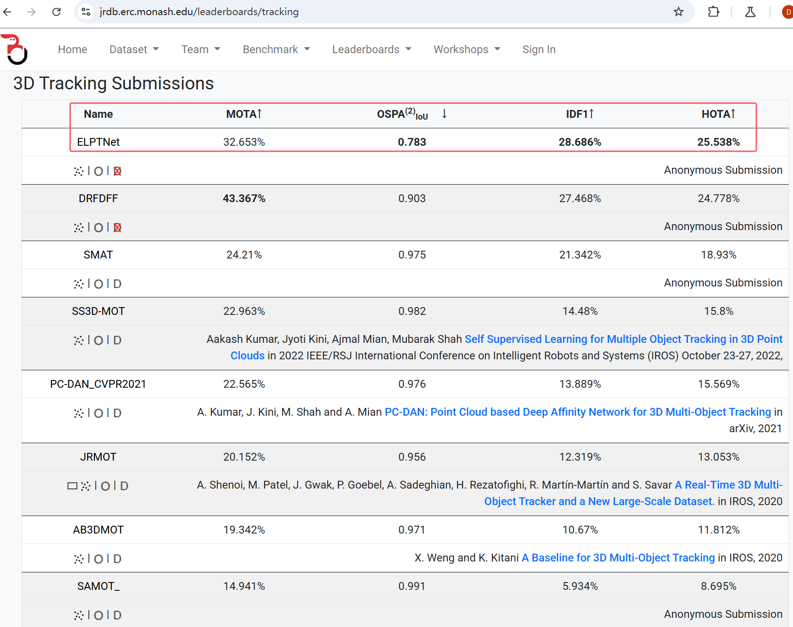

# ELPTNet

Official PyTorch implementation of ELPTNet: An Efficient LiDAR-based 3D Pedestrian Tracking Network for Autonomous Navigation Social Robots.

- 🏆 Our ELPTNet ranks first on [JRDB 3D Pedestrian Tracking Leaderboard](https://jrdb.erc.monash.edu/leaderboards/tracking).



## News

- **(2025-03-10)** 🔥 We release the code and model of our ELPTNet.

## 3D Pedestrian Tracking Submissions

|  Method | MOTA ↑ | OSPA(2)IoU ↓ | IDF1 ↑ | HOTA ↑ | 
|:-------:|:------:|:------------:|:------:|:------:|
| [SMAT](https://sites.google.com/view/smat-nav) | 24.210% |0.975 | 21.342% | 18.930% |
| ELPTNet (Ours) | 32.653%  | 0.783 | 28.686% | 25.538% |
| Improvement | 8.443%  | 0.192 | 7.344% | 6.608% |

## JRDB dataset

Download [JRDB dataset](https://jrdb.erc.monash.edu/) under `PROJECT/data`.


## Requirements

- `python>=3.10`
- `PyTorch>=1.13.1`
- `cuda>=11.6`
- `opencv-python`
- `easydict`
- `numpy`
- `scipy`


## Getting Started

```shell
# convert_labels_to_KITTI
python tracking_eval/convert_dataset_to_KITTI_tracking.py
python convertto.py
# 3D MOT
python jrdb_3DMOT.py --cfg_file jrdb.yaml
python tracking_eval/TrackEval/scripts/run_jrdb_3d.py
```

## Acknowledgement

- DCCLA [(link)](https://github.com/jinzhengguang/DCCLA)
- 3D Multi-Object Tracker [(link)](https://github.com/hailanyi/3D-Multi-Object-Tracker)
- JRMOT [(link)](https://sites.google.com/view/jrmot)
- AB3DMOT [(link)](https://github.com/xinshuoweng/AB3DMOT)

## Contact Information

If you have any suggestion or question, you can leave a message here or contact us directly: guangjinzheng@qq.com. Thanks for your attention!
